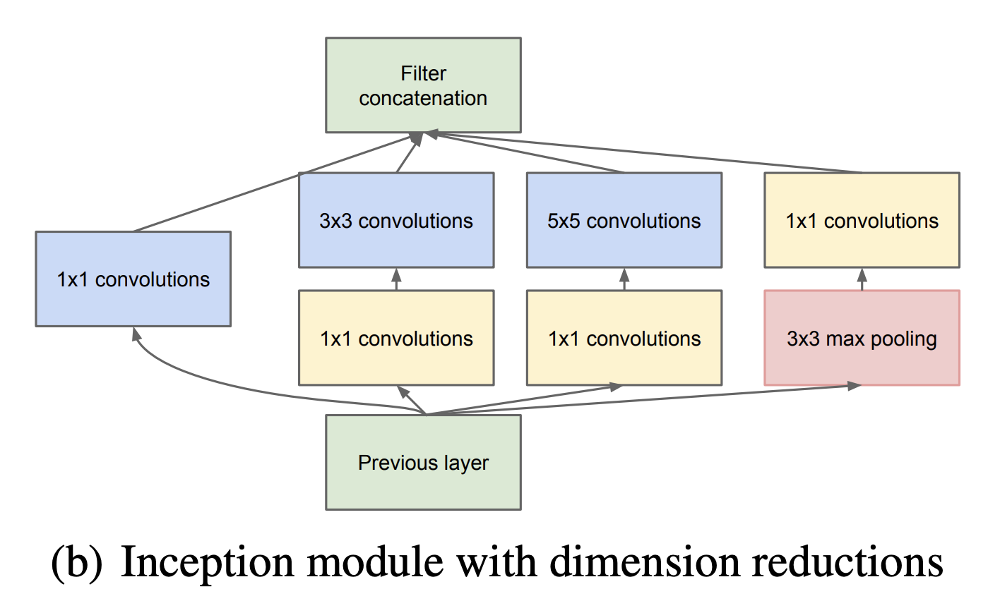

# GoogLeNet (Inception v1) — Overview & Implementation Notes

**Overview**
- GoogLeNet was the winner of ILSVRC 2014 with top-5 error of 6.67%
- This repository contains an implementation intended to be as close as possible to the [original paper](https://arxiv.org/pdf/1409.4842); see the notebook: [GoogLeNet_v1](02_CNNs/05_GoogLeNet/GoogLeNet_v1.ipynb).

**Key design problems GoogLeNet v1 addresses**
1. Optimal local sparse structure
   - Problem: The ideal sparse pattern of local connectivity (which filters to use, where) is unknown and depends on data. Directly searching for a best sparse architecture is expensive.
   - Solution in Inception v1: approximate sparse structure by combining several dense operations (1×1, 3×3, 5×5 convs and pooling) in parallel inside a single module and concatenating their outputs. This provides a multi-scale representation that mimics biological systems and the Hebbian principle ("neurons that fire together, wire together") while staying efficient.

2. Readily-available dense component
   - Problem: Dense convolutional layers (standard convs) are easy to implement but do not capture multi-scale sparsity efficiently and can be wasteful in compute.
   - Solution in Inception v1: use cheap dense building blocks (especially 1×1 convolutions) to implement dimensionality reduction and then apply larger filters. This provides a compact dense approximation to the optimal sparse connectivity while keeping parameters and FLOPS manageable.

**The Inception module (concise)**
 
- The Inception module runs multiple branches in parallel:
  - 1×1 convolution branch (captures local cross-channel correlations).
  - 1×1 → 3×3 convolution branch.
  - 1×1 → 5×5 convolution branch.
  - 3×3 max-pool → 1×1 projection branch.
- Dimension reduction with 1×1 convolutions:
  - 1×1 convs before the costly 3×3 and 5×5 convs reduce the number of channels, lowering computation and parameters.
  - This is the key trick: perform cheap cross-channel projections to reduce depth, then apply spatial convolutions.
- Output: branch outputs are concatenated along the channel dimension, producing a multi-scale feature map.

**Stacking Inception modules**
- GoogLeNet stacks many Inception modules to build depth while keeping computational cost down.
- Each stacked block increases abstraction and receptive field; the use of 1×1 reductions keeps each block efficient so depth can increase without exploding parameter count.

**Global Average Pooling (GAP) instead of Dense FC layers**
- GoogLeNet replaces the large fully-connected classifier stack with Global Average Pooling (GAP) over spatial maps followed by a single linear layer.
- Benefits:
  - Greatly reduces parameters (removes huge FC layers).
  - Acts as structural regularizer (reduces overfitting).
  - In the original paper, moving to GAP + a single linear classification layer allows efficient fine-tuning; reported small accuracy improvement in practice (paper reports ~0.6% increase in some settings when using the simpler head).

**Auxiliary classifiers (training-only)**
- Auxiliary classifiers are small classifier heads attached to intermediate layers (implemented as the [`Aux`](02_CNNs/05_GoogLeNet/GoogLeNet_v1.ipynb) class).
- Purpose:
  - Provide additional gradient signal to earlier layers (mitigate vanishing gradients).
  - Act as regularizers during training.
- Behavior:
  - Enabled only during training (they are computed and their losses are added to the total loss).
  - Deactivated during inference — the final prediction uses only the main classifier output.